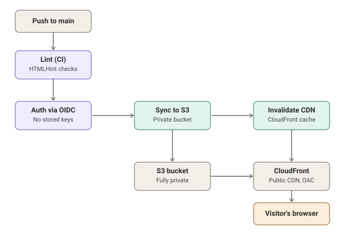

# CI/CD Pipeline: Auto-Deploy Static Site to S3/CloudFront

I built this to learn CI/CD from scratch — before this project I'd never touched GitHub Actions. It's a pipeline that automatically lints and deploys a static site to AWS every time I push to `main`, with no manual deploy steps and no AWS keys sitting in GitHub.

**Live site:** `https://<your-cloudfront-domain>.cloudfront.net`

## What it does

Every push to `main` (that touches `site/**`) does this:

1. **Lint (CI)** — HTMLHint checks the HTML. If it fails, the deploy never runs.
2. **Deploy (CD)** — if lint passes, it authenticates to AWS via OIDC, syncs `site/` to a private S3 bucket, and invalidates the CloudFront cache so the change is live within seconds.



## Architecture

- **S3** — stores the static site files. Fully private; blocks all public access.
- **CloudFront** — public-facing CDN in front of S3, using **Origin Access Control (OAC)** so only CloudFront can read from the bucket. The bucket itself is never exposed to the internet.
- **GitHub Actions** — runs the pipeline. Uses **OIDC federation** to assume an AWS IAM role for the duration of the job — no AWS access keys are stored as GitHub secrets.
- **IAM Role** — scoped to exactly two permissions: `s3:PutObject`/`s3:DeleteObject`/`s3:ListBucket` on this bucket, and `cloudfront:CreateInvalidation` on this distribution. Nothing broader.

## Why OIDC instead of access keys

I could've just pasted an AWS access key + secret into GitHub secrets and called it done — that's what most tutorials show. But that means a long-lived credential sits in GitHub forever, and if it ever leaked, it'd be valid until someone noticed and rotated it manually.

Instead I set up OIDC federation: GitHub issues a short-lived identity token for each workflow run, AWS trusts that token through an IAM OIDC provider, and grants temporary credentials scoped to just that one job. No AWS secret is ever stored anywhere. Once the job ends, the credentials are gone.

## The bug that actually taught me the most

This was the hard part of the whole project — not the YAML, the IAM trust policy. No matter what I did, GitHub Actions kept failing with:

```
Error: Could not assume role with OIDC: Not authorized to perform sts:AssumeRoleWithWebIdentity
```

I rewrote the trust policy multiple times, triple-checked the role ARN, re-verified the OIDC audience — everything *looked* correct, and it still failed every time. Eventually I stopped guessing and went to **AWS CloudTrail** (Event history, filtered by event source `sts.amazonaws.com`) to see exactly what identity AWS was actually rejecting. That's where I found the real subject claim GitHub was sending:

```
repo:AyaanK1@298484226/CICDPipeSite@1311514014:ref:refs/heads/main
```

Turns out GitHub now embeds numeric org/repo IDs directly into the OIDC subject claim (`user@id/repo@id`), not the plain `owner/repo` string that basically every tutorial and blog post assumes. My trust policy was matching against the old format, so it silently rejected every request. Fixed it with a wildcard pattern that covers both:

```json
"StringLike": {
  "token.actions.githubusercontent.com:sub": [
    "repo:AyaanK1/CICDPipeSite:*",
    "repo:AyaanK1@*/CICDPipeSite@*:*"
  ]
}
```

Biggest takeaway from this project: when something that "should" work keeps failing with a generic error, stop rewriting the same config over and over and go find the actual evidence. CloudTrail showed me in one look what an hour of guessing didn't.

## Repo structure

```
.
├── .github/workflows/deploy.yml   # CI (lint) + CD (deploy) pipeline
├── site/
│   └── index.html                 # static site content
├── architecture-diagram.svg
└── README.md
```

## Tech stack

- GitHub Actions
- AWS S3, CloudFront (with Origin Access Control), IAM (OIDC federation)
- HTMLHint

## What I'd add next

- Convert the AWS infra (currently clicked together by hand in the console) to Terraform
- Tighten the trust policy from a wildcard match to something more explicit
- Add a check that actually validates the deploy worked (e.g. curl the CloudFront URL and confirm a 200)
